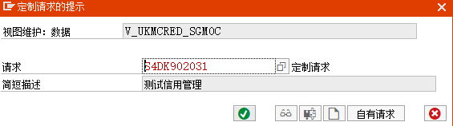
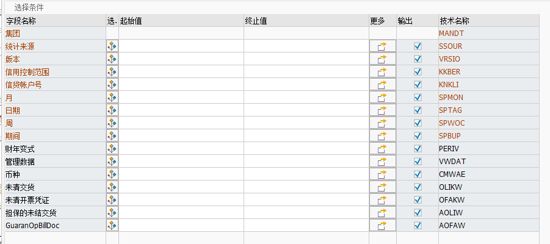

# 框架协议 Outline Agreements


> 框架协议是指与某一供货商签订的长期采购协议，供应商按某些特定条件提供物料或服务，要求在一定时间内提供一定数量或一定金额的货物或服务。

+ 计划协议 Schedule agreement
+ 合同 Contract


区别: 合同当中并没有包括具体的交货时间和交货数量，这些信息需要在后续订单中(Release Order)体现。


财务测试未清帐


信用管控要求: 即便有信贷额度,但是该客户出现拖欠情况,则可以创建销售订单,但不能交货保存


复制传输 在测试机输入事物代码`SCC1`


# 信用控制 S4-ZH

## 背景

> 现金销售和预收款销售一般发生在垄断性行业,多数企业不得不面对产品赊销的两难选择

> SAP的信用管理主要解决赊销模式和现金回流(应收账款)之间的矛盾
>
> 同时为销售部门(接单)和财务部门(收款)之间的平衡.




## 数据表

1. KNKK : 客户主数据信贷管理: 控制范围数据

   

2. KNKA: 客户主数据信贷管理: 中心数据

   


## 1. 信用控制范围


自动创建新客户配置数据

+ + ###### 风险类别: 创建新客户的时候给到这个客户的风险类别以及

  + 信贷限额:默认的信贷限额

  + 代表组:信用检测员进行分组


## 2. 给信贷控制范围分配公司代码


数据表: V_001_X

覆盖CC范围:如果勾选,则CCAr在公司代码过账的时候是一个默认的信贷控制范围.这个信贷控制范围在过帐前可以被替换成其他的信贷控制范围


## 3. 给信贷控制范围分配销售范围


数据表:V_TVTA_KKB


## 4.创建信用段


信用段:

名称:

货币:

汇率类型:

对信用段的附加缴纳:如果勾选,会同步到主信用段0000


## 5. 关联信用段和信贷控制范围


CCAr:信贷控制范围

货币:

所有公司代码:

信用段:之前创建的信用段

:imp: 更新:四个值可选

+ 空: 任意环节任意操作都不会更新客户的信用数据
+ 12:从销售订单创建,交货创建,开具发票,发票过账这些步骤都会影响客户的信用
  + 创建销售订单:根据销售订单未清交货计划行,**增加销售订单的未清值**
  + 创建交货单:减少销售订单的未清值,增加未清交货字段值
  + 开具发票:减少未清交货字段值,增加未清发票值(已开票未过账)
  + 释放到会计凭证:减少未清发票值,增加客户的应收账款总额 
+ 15:不对创建销售订单进行更新
+ 18:不对创建交货但进行更新 -->针对没有实物销售的企业


数据库表:

1. S066:未清订单: 信贷管理

   

2. S067:未清交货/发票凭证(KM)




## 6. 风险类别和风险类


**风险类和风险类别的值必须相同**

> 风险类和风险类别的值具有同步关系
>
> 对于风险类,可以在客户主数据中手工维护,也可以通过hana系统的**客户评分功能**,自动给客户归入响应的风险类,不同的分段就代表着不同的风险类.


### 6.1 定义风险类


系统预设的风险类:

> 得分越高风险越低


### 6.2 定义风险类别


风险类别和CCAr关联


### 6.3 定义风险类评分


#### 6.3.1 定义公式:计分和限额

通过结果类型来区分是计分公式还是限额公式


三种:

1. 条件:符合什么条件
2. 替代:相当于赋值
3. 例外:异常


##### 6.3.1.1 计分公式


公式:

> 判断业务伙伴(客户) 是不是80000756 --> 条件
>
> 如果是:给他100分  -->替代
>
> 如果不是:给他5分 --> 替代


##### 6.3.1.2 限额公式


公式:

> 依据计分公式得到的分值乘以500=最终的额度


### 6.3.2 为计分和信贷限额创建规则


### 6.3.3 分配计分公式和限额公式


选中规则,然后双击计分文件夹:


+ 得分公式选择之前创建的计分公式
+ 有效性:公式在规则中有效的天数 ->  365天 :question: 是这样么?
+ BW-得分:需要BW的模块

+ ...其实是跟踪:为了前台显示公式


## 7. 信贷组

> 根据不同的业务交易可以定义不同的信贷组,为后面的信贷自动控制来选择


## 8. 给信贷组分配销售凭证和交货凭证


### 8.1 销售自动控制

根据销售订单类型进行信贷检查


D:自动信贷控制

00:信贷组


### 8.2 交货自动控制


> 定义交货触发信贷检查


## 8. 信贷自动控制


CCAr:

Rkc:风险类别

CG:信贷组

信贷控制:

无信用检查:在什么情况下不进行信用检查

项目检查:是否在输入行项目数据的时候,就进行信用检查,并提示信用超额的信息

+ 下达的单据仍然未处理:-->被信贷冻结的单据被释放之后,如果再对这一单据进行处理,是否需要进行信贷检查
  + 偏差在%:单据的修改金额的偏差在这个百分比之内,就不会重新进行信贷检查
  + 天数:自单据创建到修改的间隔天数,如果超过设定值就要重新信贷检查,空白表示默认1天

+ 核查:
  + SAP信用管理

  + 响应状态:如果超出额度,则会提示用户的消息

  + 冻结:超出限额,冻结单据

    


## 9.信贷检查规则


+ 使计分无效并重算计分 : 重新对客户得风险类进行评分
+ 信贷风险总额统计检查:静态信贷检查.系统比较客户信用额度和已分配金额.如果信贷已分配金额超过信用额度,则执行响应操作
+ 最大凭证值得检查:对每个单据得金额是否做信贷检查.
+ 用信贷水平得动态限制检查:动态检查,考虑展望期.动态检查会考虑未清订单和未清交货,需要输入展望期(信用有效期天数)
+ 最大催款等级检查: 
+ 陈旧未清项目得年限检查:最早得未清项目检查,
+ 付款行为索引得检查
+ 最大未清项%
+ 未清项目天数
+ 显示信用分析者


## 错误


### 修改销售订单时,条目 T001 A 不存在T691A内－请检查输入  消息号 00058


----


到se16n下查看这个表T691A(信用管理风险类别)

没有定义A


> 最好将每个风险类全部定义一遍 和你的信用控制范围关联起来


# ABAP


## 问题清单以及解决

### 添加按钮用于销售订单导入模板的下载


1. 首先要将模板上传 SMW0


创建时,会自己指定文档的id,这个id被程序所用


### COBRB 表结算类型PERBZ 文本不一致现象

> 需要转一下 PERBZ的语言相关的转换

```abap
  CALL FUNCTION 'CONVERSION_EXIT_PERBZ_OUTPUT'
      EXPORTING
        INPUT         = gt_pm005-perbz
    IMPORTING
      OUTPUT        = gt_pm005-perbz
              .
```

> 注意 : 如果PERBZ 作为选择屏幕或者select的条件时 是不需要转的


# HANA STDIO


## 连接 登陆


